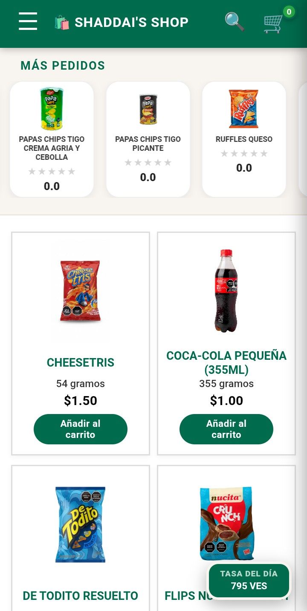
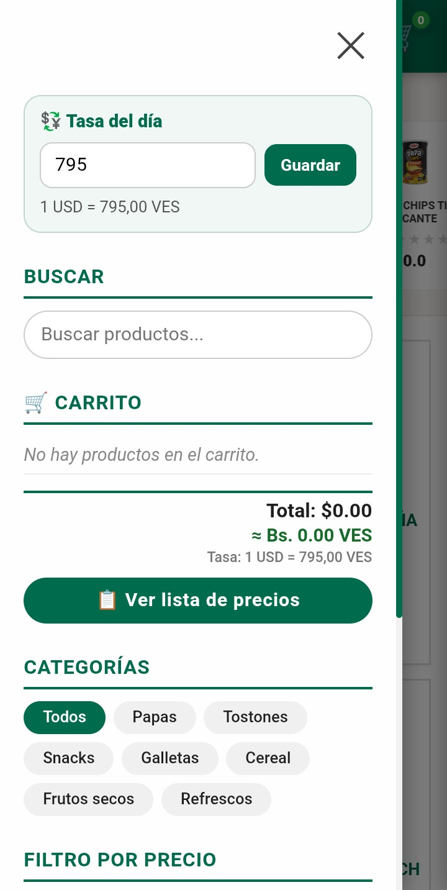
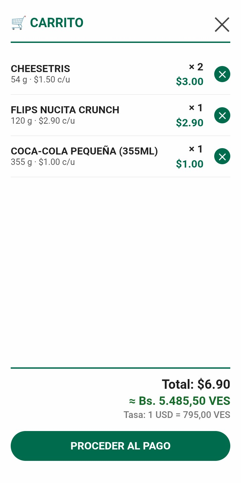
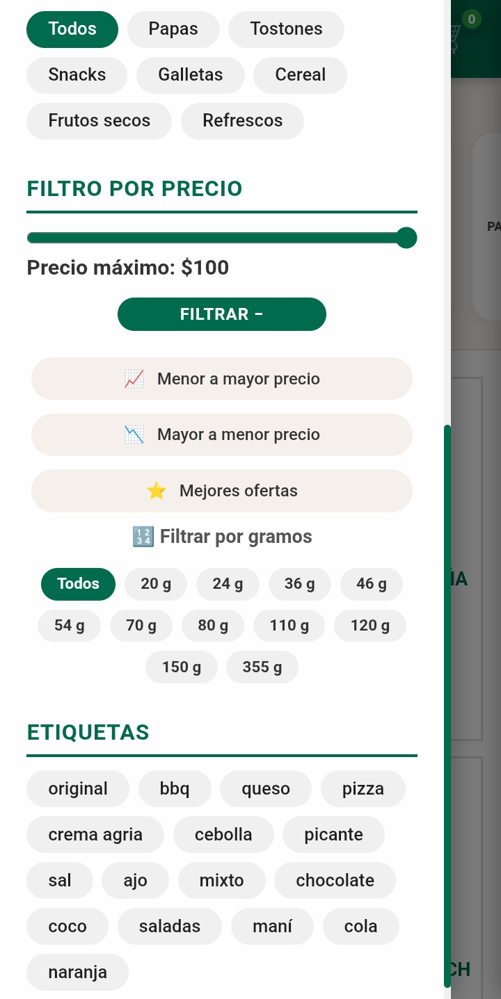
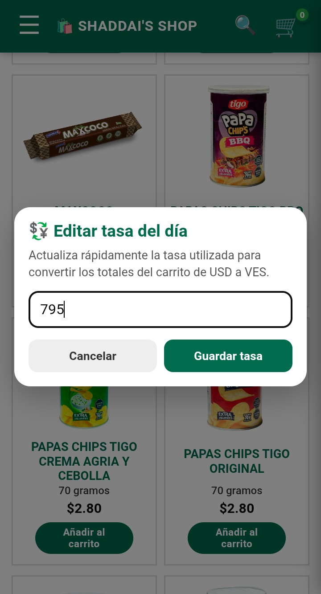

# 🛍️ Shaddai's Shop

> Prototipo de tienda web **mobile-first** para pequeños comercios y emprendimientos, diseñado para consultar productos, filtrar el catálogo, gestionar un carrito de compras y preparar pedidos mediante pagos rápidos efectuados de inmediato vía WhatsApp.


<p align="center">
  <a href="https://github.com/dar003/Shaddai-s-Shop-Prototipo-de-Ventas">
  
  
    
  
  
  </a>
</p>

<p align="center">
  
  
  
  
</p>

<p align="center">
  <a href="https://github.com/dar003/Shaddai-s-Shop-Prototipo-de-Ventas/commits/main">
    
  </a>
  <a href="https://github.com/dar003/Shaddai-s-Shop-Prototipo-de-Ventas/stargazers">
    
  </a>
  <a href="https://github.com/dar003/Shaddai-s-Shop-Prototipo-de-Ventas/issues">
    
  </a>
</p>


<table align="center" style="border-collapse: collapse; width: 100%;">
  <tr>
    <td align="center" width="33%" style="border: 1px solid #444; padding: 16px; vertical-align: top;">
      
      <br><br>
      <strong>Home</strong><br>
      Catálogo y productos
    </td>
    <td align="center" width="33%" style="border: 1px solid #444; padding: 16px; vertical-align: top;">
      
      <br><br>
      <strong>Carrito</strong><br>
      Productos y pedido
    </td>
    <td align="center" width="33%" style="border: 1px solid #444; padding: 16px; vertical-align: top;">
      
      <br><br>
      <strong>Checkout</strong><br>
      Pedido por WhatsApp
    </td>
  </tr>
</table>


### 🌐 Shaddai's Shop · [▶ Probar la demo en vivo](https://dar003.github.io/Shaddai-s-Shop-Prototipo-de-Ventas/)

Una experiencia de compra ligera y optimizada para dispositivos móviles.

No requiere instalación de dependencias, tampoco de un proceso de compilación para ejecutar el prototipo: la aplicación está implementada actualmente en un único directorio `index.html`.

---

## ✨ Características principales

### 🛍️ Catálogo de productos

Visualiza los productos disponibles mediante una cuadrícula responsive con imagen, nombre, presentación y precio. Además podrás apreciar la valoración de cada producto con calificaciones actualizadas en tiempo real.

### 🔎 Búsqueda rápida

Busca productos directamente desde el encabezado o desde el panel lateral. Los resultados se actualizan mientras escribes.

### 🧩 Filtros inteligentes

Combina diferentes criterios para localizar productos:

- Categoría
- Etiquetas
- Precio máximo
- Presentación en gramos
- Orden por precio
- Mejores ofertas

Los filtros se aplican dinámicamente sobre el catálogo.

### ⭐ Valoraciones y productos destacados

El catálogo incorpora valoraciones numéricas y una sección superior de productos destacados mediante un carrusel animado ubicado en un mini banner que se localiza en la parte superior de la pantalla principal.

### 🧺 Carrito de compras

Añade productos al carrito y controla las cantidades directamente desde las tarjetas de producto.

El carrito muestra:

- Producto seleccionado
- Cantidad
- Precio unitario
- Subtotal
- Total de la compra
- Equivalencia en VES

### 📋 Lista de precios

Alterna entre la vista tradicional del catálogo y una vista compacta especialmente pensada para consultar rápidamente los precios.

La lista muestra simultáneamente:

- Producto
- Categoría
- Presentación
- Precio en USD
- Equivalencia aproximada en VES

### 💱 Conversión USD / VES

La aplicación permite establecer una tasa de cambio personalizada.

El valor configurado se utiliza automáticamente para calcular la equivalencia de los productos y del total del carrito en bolívares.

La tasa actual se muestra mediante un botón flotante que también permite editarla rápidamente.

### 📲 Checkout mediante WhatsApp

El proceso de pago genera automáticamente un resumen del pedido con:

- Número de pedido - Generado de forma aleatoria
- Productos seleccionados
- Cantidades
- Subtotales
- Total en USD
- Total equivalente en VES
- Tasa de conversión utilizada

El resumen del detalle se prepara para ser enviado mediante WhatsApp.

### 🖼️ Vista ampliada de productos

Al seleccionar una tarjeta de producto se puede abrir una visualización ampliada de su imagen.

### 📱 Diseño Mobile-first

La interfaz está diseñada principalmente para celulares y adapta sus componentes a diferentes tamaños de pantalla.

La navegación utiliza paneles laterales, controles compactos y elementos táctiles pensados para dispositivos móviles.

---

## 🧭 Experiencia de usuario

El flujo principal de compra está pensado para ser sencillo:

```text
Explorar productos
       ↓
Buscar / filtrar
       ↓
Seleccionar productos
       ↓
Añadir al carrito
       ↓
Revisar cantidades
       ↓
Consultar total USD / VES
       ↓
Proceder al pago
       ↓
Generar pedido
       ↓
Enviar por WhatsApp
```

La aplicación intenta reducir la cantidad de pasos necesarios entre la selección de un producto y el envío del pedido.

---

## 📸 Vista general

### 🏠 Catálogo

Vista principal orientada a descubrir productos rápidamente.

**Catálogo — productos, precios, valoraciones y acciones de compra**


---

### 🔎 Búsqueda y filtros

Herramientas para encontrar productos específicos sin recorrer manualmente todo el catálogo.

**Search & Filters — búsqueda, categorías, etiquetas, precio y presentación**



---

### 🧺 Carrito

Panel lateral dedicado a revisar los productos seleccionados antes del checkout.

**Shopping Cart — cantidades, subtotales y total**


---

### 💱 Conversión de moneda

La tasa USD/VES puede modificarse desde la interfaz y se refleja en los cálculos de la tienda.

**Currency Rate — conversión dinámica USD → VES**



---

### 📲 Pedido

El checkout transforma el contenido del carrito en un mensaje estructurado para WhatsApp.

**WhatsApp Checkout — resumen automático del pedido**


---

## 🌐 Demo

### ▶ Probar Shaddai's Shop

**[Abrir la aplicación en GitHub Pages](https://dar003.github.io/Shaddai-s-Shop-Prototipo-de-Ventas/)**

La demo funciona directamente desde el navegador y permite interactuar con el catálogo, filtros, carrito, lista de precios y conversión USD/VES.

---

## 🛠️ Tecnologías

| Tecnología          | Uso                                                           |
| ------------------- | ------------------------------------------------------------- |
| **HTML5**           | Estructura de la aplicación                                   |
| **CSS3**            | Diseño, responsive layout, animaciones y componentes visuales |
| **JavaScript ES6+** | Lógica, filtros, carrito y comportamiento interactivo         |
| **GitHub Pages**    | Publicación de la demo                                        |
| **WhatsApp**        | Canal utilizado para preparar el pedido                       |
| **SVG / Iconos**    | Elementos gráficos de la interfaz                             |

### Arquitectura actual

El prototipo utiliza una arquitectura deliberadamente ligera:

```text
Shaddai's Shop
│
└── index.html
    ├── HTML
    ├── CSS
    └── JavaScript
```

Actualmente no necesita:

- Node.js
- npm
- Framework frontend
- Backend
- Base de datos
- Proceso de build

Esto permite abrir el proyecto directamente en un navegador o publicarlo mediante servicios estáticos como GitHub Pages.

---

## 🚀 Ejecutar localmente

### Opción 1 — Abrir directamente

Clona el repositorio:

```bash
git clone https://github.com/dar003/Shaddai-s-Shop-Prototipo-de-Ventas.git
```

Entra en el proyecto:

```bash
cd Shaddai-s-Shop-Prototipo-de-Ventas
```

Después abre:

```text
index.html
```

directamente en tu navegador.

### Opción 2 — Servidor local

También puedes utilizar cualquier servidor HTTP local.

Por ejemplo, con Python:

```bash
python -m http.server 8000
```

Después abre:

```text
http://localhost:8000
```

---

## 📂 Estructura del proyecto

Actualmente el repositorio mantiene una estructura minimalista:

```text
Shaddai-s-Shop-Prototipo-de-Ventas/
│
├── index.html
└── README.md
```

La simplicidad es intencional: el proyecto se encuentra actualmente en una etapa de prototipo y toda la interfaz y lógica están contenidas en el archivo principal.

### Próxima evolución

A medida que el proyecto crezca, la estructura puede evolucionar hacia:

```text
Shaddai-s-Shop-Prototipo-de-Ventas/
│
├── index.html
├── README.md
│
├── assets/
│   ├── images/
│   └── screenshots/
│
├── css/
│   └── styles.css
│
└── js/
    ├── app.js
    ├── cart.js
    ├── filters.js
    └── currency.js
```

La separación de archivos se realizaría únicamente cuando aporte una ventaja real al mantenimiento del proyecto.

---

## 💱 Sistema de precios

Shaddai's Shop trabaja principalmente con precios base en USD y permite calcular su equivalencia en VES mediante una tasa configurable.

### Ejemplo

```text
Producto
$10.00 USD

Tasa
1 USD = 293 VES

Equivalencia
≈ Bs. 2,930.00 VES
```

La misma conversión se aplica al total acumulado del carrito.

---

## 🧺 Flujo del carrito

El carrito mantiene una representación de los productos seleccionados y calcula dinámicamente los subtotales.

```text
Producto × cantidad
        ↓
Subtotal
        ↓
Total USD
        ↓
Conversión USD → VES
        ↓
Total VES
```

También es posible incrementar o reducir cantidades directamente desde la interfaz.

---

## 📲 Flujo de pedido por WhatsApp

Cuando el usuario procede al checkout, la aplicación genera un mensaje estructurado.

Conceptualmente:

```text
📄 Recibo de Compra

Pedido #XXXXXXX

Productos:
- PRODUCTO × 2 = $XX.XX
- PRODUCTO × 1 = $XX.XX

Total a pagar: $XX.XX
Total en VES: Bs. XXX.XX

Tasa:
1 USD = XXX VES
```

El mensaje se codifica y se envía al flujo de WhatsApp disponible en el dispositivo.

---

## 🎨 Diseño

La interfaz utiliza una identidad visual basada principalmente en:

- Verde Esmeralda como color principal
- Fondos claros
- Tarjetas de productos
- Controles redondeados
- Paneles laterales
- Animaciones suaves
- Elementos táctiles grandes
- Diseño responsive

El objetivo es mantener una experiencia sencilla, rápida y reconocible para usuarios de dispositivos móviles.

---

## 📱 Responsive Design

La interfaz adapta diferentes componentes según el tamaño de pantalla.

Se han contemplado especialmente:

- Smartphones pequeños
- Smartphones estándar
- Pantallas móviles grandes
- Navegadores de escritorio

El catálogo modifica el tamaño de las tarjetas y elementos visuales para conservar una experiencia cómoda en pantallas reducidas.

---

## 🔐 Privacidad y datos

El proyecto actual es un prototipo frontend y no utiliza un backend propio para gestionar cuentas de usuario o almacenar pedidos en un servidor.

El checkout utiliza WhatsApp como canal externo para continuar la comunicación del pedido.

> ⚠️ Antes de utilizar el proyecto en un entorno comercial real, se recomienda revisar y adaptar el tratamiento de datos personales, información de contacto y métodos de pago.

---

## 🗺️ Roadmap

El proyecto continúa en desarrollo.

### Interfaz

- [x] Catálogo de productos
- [x] Diseño responsive
- [x] Filtros
- [x] Búsqueda de productos
- [x] Ordenamiento
- [x] Carrito de compras
- [x] Lista de precios
- [x] Conversión USD / VES
- [x] Tasa de cambio editable
- [x] Botón flotante de tasa
- [x] Checkout mediante WhatsApp
- [x] Visualización ampliada de productos
- [x] Carrusel de productos destacados
- [x] Separar HTML, CSS y JavaScript cuando el proyecto lo requiera
- [x] Añadir capturas oficiales al README

### Próximas mejoras

- [ ] Mejorar la gestión de datos de productos
- [ ] Persistencia del carrito
- [ ] Mejorar la experiencia de checkout
- [ ] Añadir documentación técnica
- [ ] Incorporar pruebas de interfaz
- [ ] Mejorar accesibilidad
- [ ] Optimizar carga de imágenes
- [ ] Preparar una estructura escalable para futuras versiones

---

## 📌 Estado del proyecto

**🟠 En desarrollo**

Shaddai's Shop es actualmente un prototipo funcional que continúa evolucionando en diseño, experiencia de usuario y funcionalidades.

Las características existentes pueden cambiar a medida que se incorporen nuevas versiones. La intención principal del proyecto actual es ofrecer un entorno funcional a pequeños negocios que buscan maneras de optimizar sus pedidos y obtener una mejor experiencia de usuario, permitiendo organizar y registrar los pedidos de manera rápida para la demanda requerida al momento de cada solicitud de un producto.

---

## 🤝 Contribuciones

El proyecto se encuentra principalmente en desarrollo individual.

Si encuentras un error, tienes una sugerencia o quieres proponer una mejora, puedes abrir un **Issue** en el repositorio.

También puedes utilizar un **Pull Request** para proponer cambios concretos.

Apreciaría tu sincera opinión sobre el proyecto y posibles maneras de escalarlo para hacerlo lo más óptimo posible para cada usuario, así juntos podremos contribuir al crecimiento de pequeños negocios en futuros sectores desarrollados y listos para cubrir la demanda de tecnologías y herramientas de automatización en la industria actual. 

Siempre atento a sus comentarios ;)

---

## ⭐ Apoya el proyecto

Si Shaddai's Shop te resulta interesante, puedes:

- ⭐ Dar una estrella al repositorio
- 🐛 Reportar errores
- 💡 Proponer mejoras
- 🔧 Contribuir con código
- 📣 Compartir el proyecto

Cada interacción ayuda a mejorar el proyecto.

---

## 👤 Autor

**dar003**

Proyecto desarrollado como prototipo de una solución de comercio web orientada a pequeños negocios y ventas minoristas.

### 🔗 Proyecto

**[Shaddai's Shop — GitHub](https://github.com/dar003/Shaddai-s-Shop-Prototipo-de-Ventas)**

### 🌐 Demo

**[Abrir Shaddai's Shop](https://dar003.github.io/Shaddai-s-Shop-Prototipo-de-Ventas/)**

---

## 📄 Licencia

Actualmente el repositorio no especifica una licencia de software.


---

<p align="center">
&#x20; <strong>🛍️ Shaddai's Shop</strong><br>
&#x20; Tienda web · Mobile-first · USD / VES · WhatsApp
</p>
